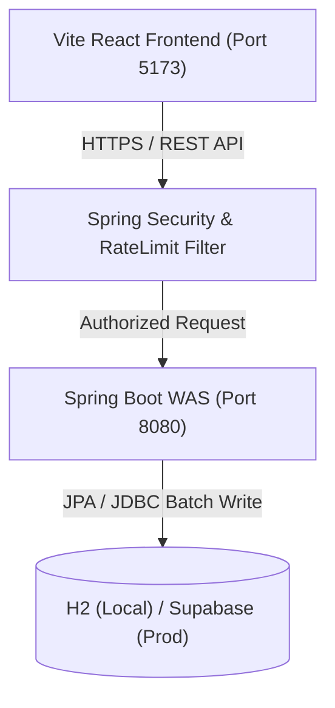
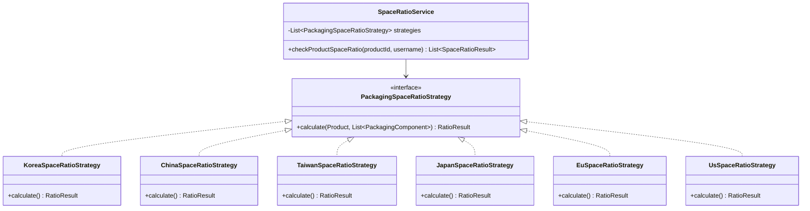
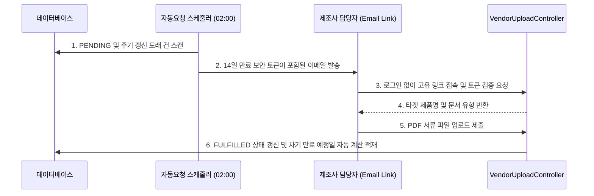

# QMS System Architecture & Security Specification

본 문서는 통합 품질 관리 시스템(QMS)의 전체적인 구성 설계, 6개국 포장공간비율 검증 엔진(Strategy 패턴), 필수 품질 서류 자동 요청 스케줄링 시스템 및 시스템 보안 운영 정책을 총괄하는 아키텍처 설명서입니다.

---

## 1. System Topology

QMS 프로그램은 Vite React 프론트엔드와 Java Spring Boot 백엔드, 그리고 PostgreSQL/H2 관계형 데이터베이스 계층으로 유기적으로 결합되어 있습니다.

---

## 2. 국가별 포장공간비율 검증 엔진 (Strategy Pattern)

국가별로 포장공간비율 및 충전율에 관한 산출 공식과 판정 임계치, 면제 조건이 상이하므로 객체 지향의 **Strategy 패턴**을 적용하여 모듈화하였습니다.

### 각 국가별 정책 하이라이트
- **한국(KR)**: 단품 포장(10%/15% 상한, 레이어 캐스케이드 및 완충재 5mm 가산) 및 종합세트(개별 구성품 PASS + 세트박스 25% PASS 동시 만족 시 최종 합격) 독립 검증 체계.
- **중국(CN)**: SAMR(GB 23350-2021) 규격을 따르며, 내용물별 k값 대입 및 1겹 포장 자동 합격(PASS) 예외 보장.
- **대만(TW)**: 화장품 기획세트(禮盒) 대상 정수올림 NPV(額定包裝體積) 연산 및 단일/복합 재질 C값 분기(3.1 / 2.7) 적용.
- **일본(JP)**: 적정포장규칙 1차 용기 충전율 40% 이상(40g 이하는 30%) 판정. 30g 이하 소형 및 메이크업/향수 류 수치 면제 처리.
- **EU/미국(US)**: EU 수송포장 50% 이하 가이드라인 제공 및 미국 FDA 정성적 오도 가능성 판정 보류(null 반환) 사양 구현.

---

## 3. 마스터 필수서류 자동요청 스케줄러 (Document Automation)

마스터 코드 품목 등록 및 제조사 연동 시, MSDS(12개월 주기) 및 최초 1회 필수 품질서류(제조공정도, 제품표준서, 안정성테스트보고서)를 자동 요청하고 벤더가 비인증 보안링크로 직접 셀프 업로드하도록 하는 파이프라인입니다.

---

## 4. 보안 및 성능 운영 정책

### 4.1 이중 Rate Limiting 방어선 (전역 + 비인증 업로드 경로)
- **전역 서블릿 필터 (`RateLimitFilter.java`)**:
  - `POST /api/auth/login` (로그인): IP당 분당 5회 제한.
  - 파일 업로드 API (`/upload`, `/file`, `/image` 포함): IP당 분당 10회 제한.
  - 메일 발송 API (`/send-email`, `/re-request`, `/mail` 포함): IP당 분당 10회 제한.
- **공개 비인증 API (`VendorUploadController.java`)**:
  - `GET /api/vendor-upload/{token}` 및 `POST /api/vendor-upload/{token}/file` 경로: IP당 **분당 3회**로 엄격하게 차단하여 외부 무단 업로드 공격 방어.

### 4.2 페이징 전수 적용 정책
대용량 데이터를 전량 메모리에 적재하는 무페이징(Memory-Heavy) 조회를 원천 배제하기 위해, 휴지통 및 생산감리 목록 조회를 JpaRepository 페이징(`Pageable`) 기반으로 강제 전환하였습니다. 
특히 여러 엔티티가 혼재된 휴지통(`Trash`)의 경우, 타입별로 최초 50개만 조회(Limit 50)하여 메모리상에서 병합/정렬 후 페이징 슬라이싱(Offset/Limit) 처리함으로써 병목을 완벽하게 해소합니다.

### 4.3 JPA 스키마 정합성 보장 (ddl-auto=validate)
JPA 엔티티의 구조와 실제 DB 마이그레이션 테이블 간 불일치로 인한 오작동을 차단하기 위해, 로컬 개발 및 테스트 실행 프로파일(`application-local.properties`)의 ddl-auto 값을 **`validate`**로 상시 강제 지정하여 시동 단계에서 오류를 검출합니다.
